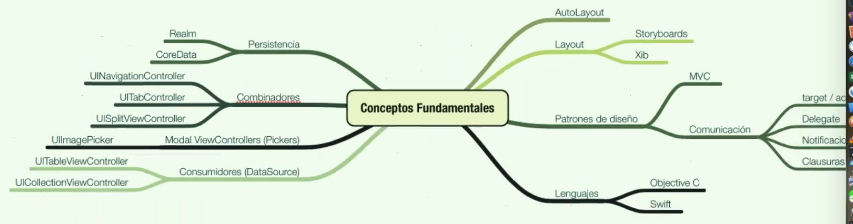

# kc-ios-fundamentos
Curso keepcoding fundamentos ios

## Temas
- Swift introduction
- App StarWars Character: UniverseTableViewController, model, JSON processing, comparable protocol
- Controller: sound implementation, protocol delegate and extension, table view delegate
- Autolayout xib
- AutoLayout
- Swift playgrounds: multidictionary

## Sesiones
- Día 1     
    - Día 1 - Sesión 1: Conceptos Fundamentales. Introducción Swift (100:10)
    - Día 1 - Sesión2: Colecciones. Iteramos por colecciones. Funciones. Funciones que reciben funciones como parámetro. Funciones que devuelven una función. (99:07)

- Día 2
    - Día 2 - Sesión 1: (91:35)    
    - Día 2 - Sesión 2: (108:48)

- Día 3
    - Día 3 - Sesión 1: (96:04)
    - Día 3 - Sesión 2: (108:30)

- Día 4
    - Día 4 - Sesión 1: (49:02)
    - Día 4 - Sesión 2: (145:59)
  
- Día 5     
    - Día 5 - Sesión 1: (92:56)
     - Día 5 - Sesión 2: (99:10)

- Día 6
    - Día 6 - Sesión 1: (107:27)
    - Día 6 - Sesión 2: (105:46)

- Día 7 - Sesión Extra
    - Día 7 - Sesión 1: (106:51)
    - Día 7 - Sesión 2: (118:26)

## Directorios
- AutoLayout: revision autolayout
- fundamentos_ios/StartWars: app StarWarsCharacters
- swift_playgrounds/: playgrounds swift 
- AsyncDataSample: Proyecto en el que se practica el uso de la librería AsyncData para la descarga y tratamiento de datos en segundo plano

## Temas de consulta
- snapkit

## Revision
- Fecha de seguimiento del curso original: 2017
- Fecha de seguimiento del curso original ya grabado: abril - mayo 2019

